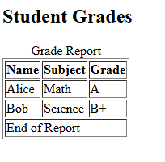

# HTML Notes

## HTML Document Structure

Every HTML5 page follows a standard structure. It tells the browser how to interpret the content.

---

### Basic Skeleton

```html
<!DOCTYPE html>
<html lang="en">
<head>
  <meta charset="UTF-8" />
  <meta name="viewport" content="width=device-width, initial-scale=1.0" />
  <title>Page Title</title>
</head>
<body>
  <h1>Hello, World!</h1>
  <p>This is my first HTML page.</p>
</body>
</html>
```


1. `<!DOCTYPE html>` - Declares that this is an HTML5 documents and is always the first line.
2. `<html lang="en">` - Root element of the page, `lang="en"` specifies the language
3. `<head>` - Contains metadata (information about the page, invisible to the users)

    Common elements include:
        a. `<meta charset="UTF-8">` - character encoding (it supports all languages)

        b. `<meta name="viewport" content="width=device-width, initial-scale=1.0">` - makes pages responsive on mobile devices.

        c. `<title>` - the title shown on browser tab.

4. `<body>` section - Contains all the visible content (text, images, buttons, forms, etc.). Users also inteact with what is contained within the body.

## HTML Text Tags

### Example Code

```html
<!DOCTYPE html>
<html lang="en">
<head>
  <meta charset="UTF-8">
  <title>Text Tags Example</title>
</head>
<body>
  <h1>Main Heading</h1>
  <p>This is a <strong>very important</strong> paragraph. Please <em>read carefully</em>.</p>
  
  <p>Line one.<br>Line two (after a line break).</p>
  
  <hr>
  
  <pre>
  Preformatted text keeps
      spaces and line breaks
  exactly as typed.
  </pre>
  
  <p>Run <code>git status</code> in your terminal.</p>
</body>
</html>
```
1. `<h1>.....</h1>` - Heading. Defines the most important title on the page. They range from `<h1>` to `<h6>`
2. `<p>.....</p>` - Paragraph. Wraps blocks of text into paragraphs. Browsers add space above/below automatically.
3. `<strong> ... </strong>` - Highlights text that has strong importance (bold + semantic meaning).
4. `<em> ... </em>` - Adds emphasis (italic + semantic meaning). Screen readers stress the word.
5. `<br>`- Break.  No closing tag. Inserts a line break inside text without starting a new paragraph.
6. `<hr>` - No closing tag. Creates a horizontal line dividing sections.
7. `<pre>....</pre>` -  Preserves whitespace and line breaks exactly as typed. Useful for code or text like poetry.
8. `<code>......</code>` - Marks text as inline code and uses monospace font. 

## HTML Specialized Text Tags

### Example Code

```html
<!DOCTYPE html>
<html lang="en">
<head>
  <meta charset="UTF-8">
  <title>Specialized Text Tags Example</title>
</head>
<body>
  <p>Here is a <span style="color:blue;">blue word</span> inside a paragraph.</p>

  <p>Water formula: H<sub>2</sub>O and exponent: 2<sup>nd</sup></p>

  <p>You can <mark>highlight important text</mark> with the mark tag.</p>

  <p>This is <small>smaller text</small> than normal.</p>

  <p><abbr title="World Health Organization">WHO</abbr> was founded in 1948.</p>

  <blockquote>
    “The only way to learn a new programming language is by writing programs in it.”
  </blockquote>

  <p>Citation: <cite>The C Programming Language</cite> by Kernighan & Ritchie</p>

  <p><del>Old Price: $50</del> <ins>New Price: $30</ins></p>

  <p>Inline quote: <q>Code is like humor.</q></p>
</body>
</html>
```

1. `<span>....</span>` - Generic inline container. Used to style specific words with css and has no special meaning by itself.
2. `<sub>....</sub>` - Subscript text (smaller, lowered)
3. `<sup>....</sup>` - Superscript text (smaller, raised).
4. `<mark>....</mark>` - Highlights text (yellow by default in browser)
5. `<small>.....</small>` - Displays text smaller than the surrounding text.
6. `<abbr title=".....">.....</abbr>` - Makes an abbreviation; full form appears on hover.
7. `<blockquote>.....</blockquote>` - For long quotations (usually intended by browsers).
8. `<q>....</q>` - Inline quotation; browsers automatically add quotes.
9. `<cite>....</cite>` - Indicates the title of a cited work (italicized)
10. `<del>....</del>` - Strikethrough -> represents deleted text.
11. `<ins>....</ins>` - Underlined- represents inserted text.

## HTML Links and Images

### Example Code

```html
<!DOCTYPE html>
<html lang="en">
<head>
  <meta charset="UTF-8">
  <title>Links and Images Example</title>
</head>
<body>
  <!-- Basic link -->
  <p>Visit <a href="https://www.example.com">Example Website</a></p>

  <!-- Link that opens in a new tab -->
  <p>Open <a href="https://www.wikipedia.org" target="_blank">Wikipedia</a> in a new tab</p>

  <!-- Image -->
  <p>Here is an image:</p>
  

  <!-- Image as a link -->
  <p>Click the image to go to Google:</p>
  <a href="https://www.google.com">
    
  </a>
</body>
</html>
```

1. `<a href= "URL">....</a>` - Anchor tag creates a hyperlink. `href="..."` is the destination URL. Opening tag `<a>` and closing tag `</a>` wrap the clickable text or element.
2. `target="_blank"` - Opens the link in a new browser tab.
3. `` -  It embeds an image. `src=".."` is the image source (URL or the file path in the local computer).`alt="..."` is the alternative text (shown if the image fails to load, used by screen readers). No closing tag for ``
4. `<a>` - Image Inside- Wrap an image with `<a>` to make an image clickable (can act like a link).

## HTML Lists

### Example Code

```html
<!DOCTYPE html>
<html lang="en">
<head>
  <meta charset="UTF-8">
  <title>Lists Example</title>
</head>
<body>
  <!-- Unordered List -->
  <h2>Shopping List</h2>
  <ul>
    <li>Milk</li>
    <li>Bread</li>
    <li>Eggs</li>
  </ul>

  <!-- Ordered List -->
  <h2>Steps to Make Tea</h2>
  <ol>
    <li>Boil water</li>
    <li>Add tea leaves</li>
    <li>Pour into a cup</li>
  </ol>

  <!-- Description List -->
  <h2>Programming Terms</h2>
  <dl>
    <dt>HTML</dt>
    <dd>The standard markup language for web pages.</dd>
    <dt>CSS</dt>
    <dd>Stylesheet language used to design HTML content.</dd>
    <dt>JavaScript</dt>
    <dd>A scripting language for interactive web pages.</dd>
  </dl>
</body>
</html>
```

1. `<ul>...</ul>` - Unordered lists displays items with bullet points. Each item is wrapped in `<li>....</li>` (list item)
2. `<ol>....</ol>` - Ordered lists displays items with numbers (1,2,3 by default). Each item is wrapped in `<li>....</li>`. Attribute `type` can change numbering (`type="a"` gives a,b,c).
3. `<dl>.....</dl>` - Description lists are used for term-definition pairs. `<dt>`- description term, `<dd>`- description detail/defn. 
4. `<li>`- List item is used inside both ordered and unordered lists to represent a single item. 

## HTML Tables

### Example Code

```html
<!DOCTYPE html>
<html lang="en">
<head>
  <meta charset="UTF-8">
  <title>Tables Example</title>
</head>
<body>
  <h2>Student Grades</h2>
  <table border="1">
    <caption>Grade Report</caption>
    <thead>
      <tr>
        <th>Name</th>
        <th>Subject</th>
        <th>Grade</th>
      </tr>
    </thead>
    <tbody>
      <tr>
        <td>Alice</td>
        <td>Math</td>
        <td>A</td>
      </tr>
      <tr>
        <td>Bob</td>
        <td>Science</td>
        <td>B+</td>
      </tr>
    </tbody>
    <tfoot>
      <tr>
        <td colspan="3">End of Report</td>
      </tr>
    </tfoot>
  </table>
</body>
</html>
```



1. `<table>...</table>` - Wraps the whole table and attributes are usually replaced by CSS
2. `<caption>`- Optional title for the table.
3. `<thead>...</thead>`- Groups the header rows of the table. Inside it, use `<tr>` (table row) and `<th>`- header cell.
4. `<tbody> ... </tbody>` - Groups the main bodyrows of the table. Inside it, rows `<tr>` contain cells `<td>` (table data).
5. `<tfoot> ... </tfoot>` - Groups the footer rows (for ex: like a sum or summary info). 
6. `<tr>`- Table row- Defines a row in a table.
7. `<th>`- Table header Cell. Bold centered text by default. Used in header rows to label columns.
8. `<td>` - Table data cell. Normal table cell (data inside a row).
9. `colspan` - this attribute allows one cell to span across multiple columns.
