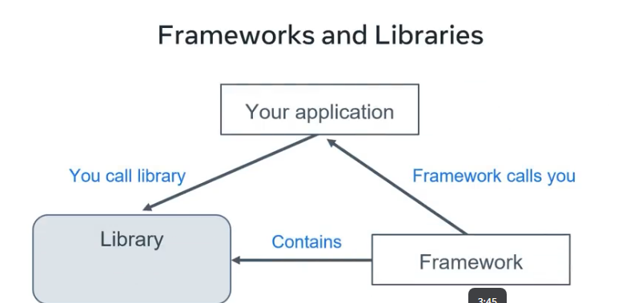
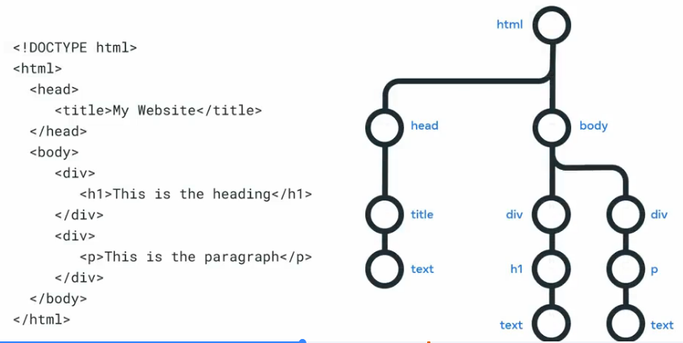
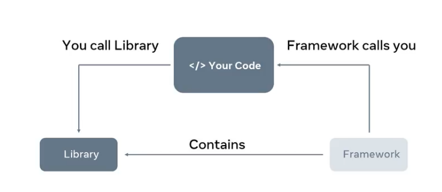
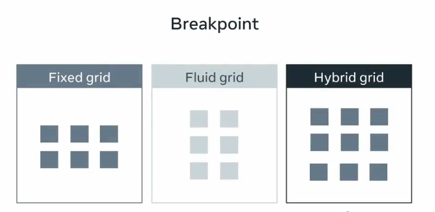
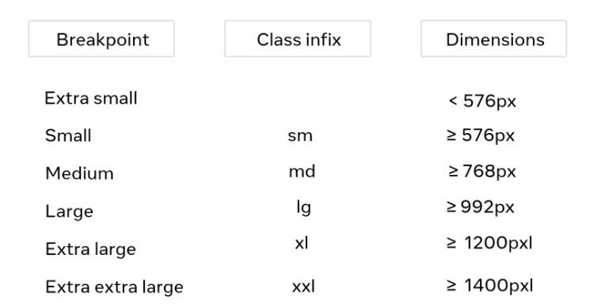

# Module 1 — Intro to Front-End Development

##  What is Front-End?

Front-end = everything users **see and interact with** in the browser.

- **HTML** → structure (headings, paragraphs, forms)
- **CSS** → presentation (colors, layout, responsiveness)
- **JavaScript** → behavior (events, data fetching, DOM updates)

---

## Client–Server & The Web (High Level)

- **Client** (browser) sends an **HTTP request** to a **server**.
- Server processes the request and returns an **HTTP response** (HTML/CSS/JS/JSON…).
- Browser **parses HTML → builds DOM**, **downloads CSS → builds CSSOM**, **executes JS**, then **paints** pixels.

---

## Internet & Web Protocols (Quick Map)

| Layer | Protocols | Why it matters to you |
|------|-----------|------------------------|
| App | **HTTP/HTTPS**, WebSocket | Requests/responses, real-time updates |
| Security | **TLS/SSL** | HTTPS encryption & trust |
| Transport | **TCP/UDP** | Reliability vs speed |
| Network | **IP** | Addressing devices |
| Names | **DNS** | Converts `example.com` → IP |

**URLs:** `scheme://host:port/path?query#hash`  
Example: `https://api.example.com:443/v1/users?id=42#details`

---

## HTTP Essentials (For Front-End)

**Methods:** `GET` (read), `POST` (create), `PUT/PATCH` (update), `DELETE` (remove), `OPTIONS` (preflight/CORS), `HEAD`.

**Status Codes:**

- `2xx` Success (e.g., `200 OK`, `201 Created`)
- `3xx` Redirects (`301 Moved Permanently`, `307 Temporary Redirect`)
- `4xx` Client errors (`400 Bad Request`, `401 Unauthorized`, `403 Forbidden`, `404 Not Found`)
- `5xx` Server errors (`500`, `503`)

**Headers (examples):**

- Request: `Accept`, `Authorization`, `Content-Type`
- Response: `Content-Type`, `Cache-Control`, `Set-Cookie`, `ETag`, `Access-Control-Allow-Origin`

**Minimal HTTP example (cURL):**

```bash
curl -X GET "https://jsonplaceholder.typicode.com/posts/1" \
  -H "Accept: application/json"
```

## HTTP Methods

These methods indicate the action that the client wishes to perform on the webserver resource. 

| **HTTP Method** | **Description** |
|------------------|-----------------|
| **GET** | The client requests a resource on the web server. |
| **POST** | The client submits data to a resource on the web server. |
| **PUT** | The client replaces a resource on the web server. |
| **DELETE** | The client deletes a resource on the web server. |
| **PATCH** | The client partially updates a resource on the web server. |

### HTTP Request Headers

After the request line, the HTTP headers are followed by a line break.

There are various possibilities when including an HTTP header in the HTTP request. A header is a case-insensitive name followed by a: and then followed by a value.

Common headers are:

```bash
Host: example.com
User-Agent: Mozilla/5.0 (Macintosh; Intel Mac OS X 10.9; rv:50.0) Gecko/20100101 Firefox/50.0
Accept: */*
Accept-Language: en
Content-type: text/json
```

The `Host` header specifies the host of the server and indicates where the resource is requested from.

The `User-Agent` header informs the web server of the application that is making the request. It often includes the operating system (Windows, Mac, Linux), version and application vendor.

The `Accept` header informs the web server what type of content the client will accept as the response.

The `Accept-Language` header indicates the language and optionally the locale that the client prefers.

The `Content-type` header indicates the type of content being transmitted in the request body.

### HTTP Request Body

HTTP requests can optionally include a request body. A request body is often included when using the HTTP POST and PUT methods to transmit data.

```bash
POST /users HTTP/1.1
Host: example.com

{
 "key1":"value1",
 "key2":"value2",
 "array1":["value3","value4"]
}

PUT /users/1 HTTP/1.1
Host: example.com
Content-type: text/json

{"key1":"value1"}
```

### HTTP Responses

When the web server is finished processing the HTTP request, it will send back an HTTP response.

The first line of the response is the status line. This line shows the client if the request was successful or if an error occurred.

`HTTP/1.1 200 OK`

The line begins with the HTTP protocol version, followed by the status code and a reason phrase. The reason phrase is a textual representation of the status code.

### HTTP Status Codes

| **Status Code** | **Category** | **Meaning / Description** |
|-----------------|--------------|----------------------------|
| **100** | Informational | Continue – request received, client can proceed. |
| **101** | Informational | Switching Protocols – server is changing protocols. |
| **200** | Success | OK – the request succeeded. |
| **201** | Success | Created – a new resource was successfully created. |
| **204** | Success | No Content – request succeeded, no content returned. |
| **301** | Redirection | Moved Permanently – resource has a new URL. |
| **302** | Redirection | Found – temporarily moved to a different URL. |
| **304** | Redirection | Not Modified – cached version can be used. |
| **400** | Client Error | Bad Request – server can’t process the request. |
| **401** | Client Error | Unauthorized – authentication required. |
| **403** | Client Error | Forbidden – client doesn’t have permission. |
| **404** | Client Error | Not Found – requested resource doesn’t exist. |
| **405** | Client Error | Method Not Allowed – HTTP method not supported. |
| **408** | Client Error | Request Timeout – client took too long to send data. |
| **409** | Client Error | Conflict – request conflicts with current state. |
| **429** | Client Error | Too Many Requests – rate limit exceeded. |
| **500** | Server Error | Internal Server Error – generic server failure. |
| **502** | Server Error | Bad Gateway – invalid response from upstream server. |
| **503** | Server Error | Service Unavailable – server temporarily overloaded or down. |
| **504** | Server Error | Gateway Timeout – upstream server failed to respond. |

### HTTP Response Headers

Following the status line, there are optional HTTP response headers followed by a line break.
Similar to the request headers, there are many possible HTTP headers that can be included in the HTTP response.
Common response headers are:

```bash
Date: Fri, 11 Feb 2022 15:00:00 GMT+2
Server: Apache/2.2.14 (Linux)
Content-Length: 84
Content-Type: text/html
```

The `Date` header specifies the date and time the HTTP response was generated.
The `Server` header describes the web server software used to generate the response.
The `Content-Length` header describes the length of the response.
The `Content-Type` header describes the media type of the resource returned (e.g. HTML document, image, video).

### HTTP Response Body

Following the HTTP response headers is the HTTP response body. This is the main content of the HTTP response.
This can contain images, video, HTML documents and other media types.

```bash
HTTP/1.1 200 OK
Date: Fri, 11 Feb 2022 15:00:00 GMT+2
Server: Apache/2.2.14 (Linux)
Content-Length: 84
Content-Type: text/html

<html>
  <head><title>Test</title></head>
  <body>Test HTML page.</body>
</html>
```

## Other Internet Protocols

### Dynamic Host configuration protocol (DHCP)

You've learned that computers need IP addresses to communicate with each other. When your computer connects to a network, the Dynamic Host Configuration Protocol or DHCP as it is commonly known, is used to assign your computer an IP address.
Your computer communicates over User Datagram Protocol (UDP) using the protocol with a type of server called a DHCP server. The server keeps track of computers on the network and their IP addresses. It will assign your computer an IP address and respond over the protocol to let it know which IP address to use. Once your computer has an IP address, it can communicate with other computers on the network.

### Domain name system protocol (DNS)

Your computer needs a way to know with which IP address to communicate when you visit a website in your web browser, for example, meta.com. The Domain Name System Protocol, commonly known as DNS, provides this function. Your computer then checks with the DNS server associated with the domain name and then returns the correct IP address.

### Internet Message access Protocol (IMAP)

Your device needs a way to download emails and manage your mailbox on the server storing your emails. This is the purpose of the Internet Message Access Protocol or IMAP.

### Simple Mail transfer protocol (SMTP)

Now that your emails are on your device, you need a way to send emails. The Simple Mail Transfer Protocol, or SMTP, is used. It allows email clients to submit emails for sending via an SMTP server. You can also use it to receive emails from an email client, but IMAP is more commonly used.

### Post office protocol (POP)

The Post Office Protocol (POP) is an older protocol used to download emails to an email client. The main difference in using POP instead of IMAP is that POP will delete the emails on the server once they have been downloaded to your local device. Although it is no longer commonly used in email clients, developers often use it to implement email automation as it is a more straightforward protocol than IMAP.

### File transfer protocol (FTP)

When running your websites and web applications on the Internet, you'll need a way to transfer the files from your local computer to the server they'll run on. The standard protocol used for this is the File Transfer Protocol or FTP. FTP allows you to list, send, receive and delete files on a server. Your server must run an FTP Server and you will need an FTP Client on your local machine. You'll learn more about these in a later course.

### Secure shell protocol (SSH)

When you start working with servers, you'll also need a way to log in and interact with the computer remotely. The most common method of doing this is using the Secure Shell Protocol, commonly referred to as SSH. Using an SSH client allows you to connect to an SSH server running on a server to perform commands on the remote computer.
All data sent over SSH is encrypted. This means that third parties cannot understand the data transmitted. Only the sending and receiving computers can understand the data.

### Secure file transfer protocol (SFTP)

The data is transmitted insecurely when using the File Transfer Protocol. This means that third parties may understand the data that you are sending. This is not right if you transmit company files such as software and databases. To solve this, the SSH File Transfer Protocol, alternatively called the Secure File Transfer Protocol, can be used to transfer files over the SSH protocol. This ensures that the data is transmitted securely. Most FTP clients also support the SFTP protocol.

## Tools that are used

| Tool                   | What it’s for              | Example(s)                |
| ---------------------- | -------------------------- | ------------------------- |
| **IDE/Editor**         | Writing code efficiently   | **VS Code**, WebStorm     |
| **Version Control**    | Track changes, collaborate | **Git**, GitHub           |
| **Package Manager**    | Install libs/tools         | **npm**, yarn, pnpm       |
| **Build Tools**        | Bundle/transform assets    | **Vite**, webpack, Parcel |
| **Linters/Formatters** | Code quality               | ESLint, Prettier          |
| **Browser DevTools**   | Inspect DOM/CSS/Net/Perf   | Chrome/Firefox DevTools   |

## Libraries vs Frameworks

**Library:** You call it when needed (You control the flow.)
**Framework:** It calls your code. (it controls the flow- "inversion of control")

| Category            | Popular Options                | What they help with             |
| ------------------- | ------------------------------ | ------------------------------- |
| **UI Frameworks**   | **React**, Angular, Vue        | Build component-based UIs       |
| **Meta Frameworks** | **Next.js**, Nuxt, SvelteKit   | Routing, SSR/SSG, data-fetch    |
| **CSS Frameworks**  | **Tailwind CSS**, Bootstrap    | Utilities/components & layout   |
| **State/Data**      | Redux, Zustand, TanStack Query | State mgmt, server cache        |
| **HTTP**            | **fetch**, **Axios**           | Requests, interceptors, retries |
| **Utilities**       | Lodash, Day.js                 | Common helpers (dates, arrays)  |



## APIs and Webservices

An API is a contract (endpoints + data format) to access functionality/data.
A service, application or interface offering advanced functionality with simple syntax.
An API is a set of functions and procedures for creating applicatins that access the features or data of an operating system, application or other service. 

Types: 

1. Browser/Web API are built into the browser itself. They extend the functionality of the browser by adding new services and are designed to simplify complex functions, provide easy syntax by building advanced features. (Ex: DOM API) 

The DOM API turns the html document into a tree of nodes that are represented as JavaScript objects. Another example, is the geolocation API that returns coordinates of where the browser is located. There are also other API's available for fetching data known as Fetch API drawing, graphics or Canvas API keeping history or history API. 

| Term         | Description                                           |
| ------------ | ----------------------------------------------------- |
| **Endpoint** | A URL that performs an operation. Example: `/users/1` |
| **Request**  | Sent from the client (browser) to the API.            |
| **Response** | Data sent back from the server (usually JSON).        |

**Common styles:**

**REST (JSON over HTTP): (/users, /users/42)**

REST or **representational state transfer**, is a set of principles that help build hi ghly efficient API's. One of the main responsibilities of these kinds of API's is sending and receiving data to and from a centralized database.

**Sensor based APIs:**

This is what the internet of things also known as IOT is based on. These are actual physical senses that are interconnected with each other. The sensors can communicate through API and track and respond to physical data. Some examples are Philips hue, smart lights and node bots.

GraphQL (queries/mutations): single endpoint /graphql
Webhooks (server calls you), WebSocket (real-time)
Auth basics: API keys (simple), Bearer tokens, OAuth 2.0 (login via providers).

## Developer Tools (Browser DevTools)

Modern browsers include **Developer Tools (DevTools)** that help you **inspect, debug and edit** web pages.


### Main DevTools Panels

| Panel | What you see | What you do with it |
|-------|--------------|----------------------|
| **Elements** (Inspector) | The HTML structure (DOM) + applied CSS | Edit HTML, change styles, test layouts, see box model |
| **Styles / Computed** | CSS rules and the final computed styles | Toggle properties, try new values, debug why a style isn’t applied |
| **Console** | JavaScript logs and errors | Run JS commands, test snippets, see `console.log()` output |
| **Network** | Every HTTP request (HTML, CSS, JS, images, API calls…) | Check status codes, response times, request/response headers, payloads |
| **Sources** | Source files (JS, HTML, CSS) | Set breakpoints, step through JS code, debug logic |
| **Application / Storage** | Cookies, localStorage, sessionStorage, IndexedDB, cache | Inspect / clear client-side data, debug login/session issues |
| **Performance** | Timeline of CPU work, rendering, layout | Find slow scripts, layout thrashing, rendering bottlenecks |
| **Lighthouse** | Automated audits for performance, accessibility, SEO | Get suggestions to improve page quality |

## What is IDE?

Integrated Development Environment (IDE) is a software that combines a text editor, compiler and debugger for coding efficiency. Ex. include VS Code, WebStorm.

They help in Syntax highlighting, Code completion, Error detection, Extensions.


# Module 2- Intro to HTML and CSS

## HyperText Markup Language

HTML (HyperText Markup Language) is a markup language used to structure content on web pages. It defines elements, structure, and meaning using tags. Browsers read HTML and convert it into DOM (Document Object Model- See below in the same module)

```html
<!DOCTYPE html>
<html lang="en">
<head>
  <meta charset="UTF-8">
  <title>My First Page</title>
</head>
<body>
  <h1>Hello World</h1>
  <p>This is my first HTML document.</p>
</body>
</html>
```

### HTML Documents

| Part              | Purpose                                                      |
| ----------------- | ------------------------------------------------------------ |
| `<!DOCTYPE html>` | Tells the browser that this is an HTML5 document.            |
| `<html>`          | The root element of the document.                            |
| `<head>`          | Contains metadata, links, styles, not visible to users.      |
| `<body>`          | Contains visible content such as text, images, links, forms. |


```html
<!DOCTYPE html>
<html lang="en">
<head>
  <meta charset="UTF-8"> <!-- Character encoding -->
  <meta name="viewport" content="width=device-width, initial-scale=1.0">
  <title>Example Page</title>
</head>

<body>
  <h1>Main Heading</h1>
  <p>Some text content.</p>
</body>
</html>
```

### Simple HTML Tags

#### Common structuaral Tags

| Tag           | Meaning                  | Example                      |
| ------------- | ------------------------ | ---------------------------- |
| `<h1>`–`<h6>` | Headings                 | `<h1>Title</h1>`             |
| `<p>`         | Paragraph                | `<p>Hello</p>`               |
| `<br>`        | Line break               | `<br>`                       |
| `<hr>`        | Horizontal line          | `<hr>`                       |
| `<strong>`    | Important/bold text      | `<strong>Important</strong>` |
| `<em>`        | Emphasized text (italic) | `<em>Note</em>`              |

#### Grouping Tags

| Tag      | Purpose               |
| -------- | --------------------- |
| `<div>`  | Block-level container |
| `<span>` | Inline container      |

#### Lists

```html
<ul>
  <li>Item 1</li>
  <li>Item 2</li>
</ul>

<ol>
  <li>First</li>
  <li>Second</li>
</ol>
```

### Linking Documents (Hyperlinks)

Anchor Tag

| Attribute         | Purpose                      |
| ----------------- | ---------------------------- |
| `href`            | URL to navigate to           |
| `target="_blank"` | Opens link in a new tab      |
| `rel="noopener"`  | Security when using `_blank` |

```html
<a href="https://www.example.com" target="_blank" rel="noopener">
  Visit Example
</a>

<a href="./about.html">About Page</a>
```

### Adding Images to a Webpage

| Attribute          | Purpose                                          |
| ------------------ | ------------------------------------------------ |
| `src`              | Image path or URL                                |
| `alt`              | Text shown when image fails or for accessibility |
| `width` / `height` | Optional size controls                           |

```html

```

```markdown
project/
│ index.html
│ about.html
└── images/
      cat.jpg
```

### Data in Tables using HTML

Tables help display structured data.

```html
<table border="1">
  <tr>
    <th>Name</th>
    <th>Age</th>
  </tr>
  <tr>
    <td>Alice</td>
    <td>22</td>
  </tr>
  <tr>
    <td>Bob</td>
    <td>25</td>
  </tr>
</table>
```

| Tag                           | Purpose           |
| ----------------------------- | ----------------- |
| `<table>`                     | Creates a table   |
| `<tr>`                        | Table row         |
| `<th>`                        | Header cell       |
| `<td>`                        | Data cell         |
| `<caption>`                   | Table title       |
| `<thead>` `<tbody>` `<tfoot>` | Semantic grouping |

### HTML Forms

Forms collect input user. They send data using `GET` or `POST`. `label` improves accessibility. 

```html
<form action="/submit" method="POST">
  <label for="name">Name:</label>
  <input id="name" type="text" name="username">

  <label for="age">Age:</label>
  <input id="age" type="number" name="age">

  <button type="submit">Submit</button>
</form>
```

| Type       | Example                   |
| ---------- | ------------------------- |
| `text`     | `<input type="text">`     |
| `email`    | `<input type="email">`    |
| `password` | `<input type="password">` |
| `number`   | `<input type="number">`   |
| `checkbox` | `<input type="checkbox">` |
| `radio`    | `<input type="radio">`    |
| `file`     | `<input type="file">`     |
| `submit`   | `<input type="submit">`   |

### Intro to DOM 

Document Object Model (DOM). It is the browser's internal tree representation of your HTML.

```css
html
├── head
└── body
    ├── h1
    └── p
```

**DOM allows JavaScript to:**

1. Select elements
2. Modify text and styles
3. Add/remove elements
4. Listen for events.

```js
document.querySelector("h1").textContent = "Title changed!";
```



All elements in the HTML File are represented as objects in DOM

### Web Accessibility

Accessibility is making websites usable for everyone, including people with disabilities.

**Key Principle:**

1. Provide **alt text** for images.
2. Use semantic HTML (`(<header>`, `<main>`, `<nav>`, `<footer>`).
3. Labels for form elements.
4. Ensure good color contrast.
5. Use heading levels logically (`<h1>` → `<h2> `→ `<h3>`)

**Accessible Example:**

```html


<label for="email">Email Address</label>
<input type="email" id="email" name="email">
```

## Casacading Style Sheet basics

### Selecting and Styling

| Method                              | Example                                     | Use Case                     |
| ----------------------------------- | ------------------------------------------- | ---------------------------- |
| **Inline**                          | `<p style="color:red">`                     | Quick tests, not recommended |
| **Internal** (in `<style>` tag)     | `<style> p { color:red; } </style>`         | Small pages                  |
| **External** (separate `.css` file) | `<link rel="stylesheet" href="styles.css">` | Best practice                |

```html
<link rel="stylesheet" href="styles.css">
```

```css
body {       //body is the selector 
  background-color: #fafafa;
  color: #333; //colour is the property and the #333 is the value of the property
} code within curly braces is called a declaration block.
```

### Types of CSS Selectors

CSS selectors choose which elements to style.

Basic Selectors

| Selector      | Example      | Description                            |
| ------------- | ------------ | -------------------------------------- |
| **Element**   | `p {}`       | Selects all `<p>` elements             |
| **Class**     | `.item {}`   | Selects all elements with class="item" |
| **ID**        | `#header {}` | Selects element with id="header"       |
| **Universal** | `* {}`       | Selects ALL elements                   |

Combinators

| Type             | Example   | Meaning                     |
| ---------------- | --------- | --------------------------- |
| Descendant       | `div p`   | All `<p>` inside a `<div>`  |
| Child            | `div > p` | Direct children only        |
| Adjacent sibling | `h1 + p`  | First `<p>` after an `<h1>` |
| General sibling  | `h1 ~ p`  | All `<p>` after `<h1>`      |

**Attribute Selectors:**

```css
input[type="email"] { border: 2px solid blue; }
```

**Pseudo-classes:**

```css
a:hover { color: red; }
input:focus { outline: 2px solid green; }
```

**Pseudo-elements**

```css
p::first-line { font-weight: bold; }
```

#### ID Selectors

The ID selector uses the id attribute of an HTML element. Since the id is unique within a webpage, it allows the developer to select a specific element for styling. ID selectors are prefixed with a `#` character.

```html
<span id="latest">New!</span>
```

```css
#latest { 
  background-color: purple; 
}
```

#### Class Selectors

Elements can also be selected based on the class attribute applied to them. The CSS rule has been applied to all elements with the specified class name. The class selector is prefixed with a . character.

In the following example, the CSS rule applies to both elements as they have the navigation CSS class applied to them.

```html
<a class="navigation">Go Back</a>
<p class="navigation">Go Forward</p>
```

```css
.navigation { 
  margin: 2px;
}
```

#### Descendant selectors

Descendant selectors are useful if you need to select HTML elements that are contained within another selector.

```html
<div id="blog">
  <h1>Latest News</h1>
  <div>
    <h1>Today's Weather</h1>
    <p>The weather will be sunny</p>
  </div>
  <p>Subscribe for more news</p>
</div>
<div>
  <h1>Archives</h1>
</div>
```

```css
#blog h1 {
  color: blue;
}
```

The CSS rule will select all `h1` elements that are contained within the element with the ID `blog`. The CSS rule will not apply to the `h1` element containing the text `Archives`.

#### Child Selectors

Child selectors are more specific than descendant selectors. They only select elements that are immediate descendants (children) of a selector (the parent).

```html
<div id="blog">
  <h1>Latest News</h1>
  <div>
    <h1>Today's Weather</h1>
    <p>The weather will be sunny</p>
  </div>
  <p>Subscribe for more news</p>
</div>
```

To style the `h1` element containing the text `Latest News`, you can use the following child selector:

```css
#blog > h1 {
  color: blue;
}
```

### Text and Color in CSS

**Color Formats:**

| Type                     | Example                          |
| ------------------------ | -------------------------------- |
| Keyword                  | `color: red;`                    |
| HEX                      | `color: #ff5733;`                |
| RGB                      | `color: rgb(255, 87, 51);`       |
| RGBA (with transparency) | `color: rgba(255, 87, 51, 0.5);` |
| HSL                      | `color: hsl(20, 100%, 50%);`     |

**Text Styling properties:**

```css
h1 {
  font-family: Arial, sans-serif;
  font-size: 2rem;     /* scalable */
  font-weight: bold;
  line-height: 1.5;
  text-align: center;
  text-decoration: underline;
  color: #333;
}
```

**Font families:**

Serif → Times New Roman

Sans-serif → Arial, Helvetica

Monospace → Courier New

### Box Model Instructions

Every HTML element is a box. It contains: Content, padding, Border, Margin.

```lua
+-------------------------+
|        margin           |
|  +-------------------+  |
|  |     border        |  |
|  |  +-------------+  |  |
|  |  |   padding   |  |  |
|  |  |  content    |  |  |
|  |  +-------------+  |  |
|  +-------------------+  |
+-------------------------+
```

Content- There is content width and height.

Padding- The Extra space around the content. Extends the content size. Described by padding height and width

Border- Around content/padding. Described by border box width and height

Margin- It extends the border to seperate the element from its neighbouring elements. Size is known as margin box width and margin box height.

**Example:**

```css
.card {
  width: 300px;
  padding: 20px;
  border: 2px solid #333;
  margin: 20px;
  box-sizing: border-box;
}
```

### Document Flow- Block vs Inline Elements

The web browsers normal way of calculating the position of html elements on the screen is called document flow.

A block level element will occupy the full horizontal width of its parent element and the vertical height of its content. Each block level element will have a new line before and after. Therefore, multiple block level elements will stack on top of each other like a stack of boxes.

**Examples:**

```css
<div>, <p>, <h1>–<h6>, <ul>, <table>, <section>, <header>, <footer>
```

Inline elements only occupy the width and height of their content. They don't appear on a new line, hence the name inline. 

**Example:**

```css
<span>, <a>, <strong>, <em>, 
```

| Type             | Width          | Starts New Line | Accepts Width/Height |
| ---------------- | -------------- | --------------- | -------------------- |
| **Block**        | 100%           | Yes             | Yes                  |
| **Inline**       | Content-only   | No              | No                   |
| **Inline-block** | Content or set | No              | Yes                  |

### Alignment

**Text alignment:**

```css
p {
  text-align: center;    /* left, right, justify */
}
```

**Horizontal Alignment (block element):**

Center of a block:

```css
p {
  text-align: center;    /* left, right, justify */
}
```

**Flexbox Alignment (modern method):**

```css
.container {
  display: flex;
  justify-content: center; /* horizontal */
  align-items: center;     /* vertical */
}
```

**Vertical alignment (inline elements):**

```css
img {
  vertical-align: middle;
}
```

# Module 3- UI Frameworks

## Working with Libraries

A library is a reusable collection of code (CSS/JS) that helps you build UI faster.

1. You do NOT write everything from scratch.
2. You simply use pre-built styles, classes, or functions.



**Examples of Libraries:**

| Type             | Examples                | Purpose                           |
| ---------------- | ----------------------- | --------------------------------- |
| CSS UI libraries | Bootstrap, Tailwind CSS | Prebuilt styles, grids, utilities |
| JS libraries     | jQuery, Lodash          | Helpers & DOM utilities           |
| Icon libraries   | Font Awesome            | Icons                             |
| Animation libs   | AOS, Animate.css        | Animations                        |

A package manager is a tool that automatically downloads and installs dependencies. We also refer to dependencies as packages. (Ex: NPM- Node Package Manager)


## Responsive Design

Responsive Design ensures your website looks good on all screen sizes. (desktop -> tablet -> phone)

**Core principles:**

1. Using fluid layouts instead of fixed widths.
2. Use relative lengths : `%`, `em`, `rem`, `vw`, `vh`
3. Use media queries

Flexible grids are made up of **columns, gutters and margins.**

The space between the columns is called the gutter and the spaces between the content and the left and right edges of the screen are called margins.

Instead of defining website Element sizes based on pixels, flexible grids are defined in percentage values, allowing them to adjust depending on screen size. Next you have fluid images by setting the CSS max width property of images to 100%. The images will scale down smaller if they're containing column becomes narrower than the images size but never grow larger.

```css
img {
  max-width: 100%;
  height: auto;
}
```

Media Queries allow developers to query the display size orientation and aspect ratio to conditionally apply CSS rules. 

```css
@media (max-width: 600px) {
  .menu { font-size: 1rem; }
}
```

### Breakpoint

A breakpoint is the point at which a website's content and layout will adapt to provide the best possible user experience.

A Breakpoint can function in different ways across three different grids: a **fixed grid** **fluid/full-width grids** and **hybrid grids.**



1. **Fixed grid:** The fixed grid has a fixed content with that doesn't change in a specific breakpoint range while the flexible margins occupy the remaining space on screen. 

2. **Full-width grids:** Then we have fluid or full width grids with fluid with columns and fixed gutters and side margins. The fluid grid has a flexible content with that goes edge to edge as per the screen size. In a fluid grid, columns either grow or shrink to adapt to the available space.

3. **Hybrid grids:** And finally there are hybrid grids that have both fluid width and fixed with components.

## Bootstrap

Bootstrap is a library of CSS and JavaScript code that you can combine to quickly build visually appealing websites.

Modern web development is all about **components**. Small pieces of reusable code that allow you to build websites quickly. Bootstrap comes with multiple components for very fast construction of multiple components, or parts of components.

Another important aspect of modern development is **responsive grids** which allow web pages to adapt their layout and content depending on the device in which they are viewed. Bootstrap comes with a pre-made set of CSS rules for building a responsive grid.

**Put this inside `<head>`:**

```html
<link 
  href="https://cdn.jsdelivr.net/npm/bootstrap@5.3.2/dist/css/bootstrap.min.css" 
  rel="stylesheet">
```

**Bootstrap JS (Optional):**

```html
<script 
  src="https://cdn.jsdelivr.net/npm/bootstrap@5.3.2/dist/js/bootstrap.bundle.min.js">
</script>
```

### The Basics

```html
<div class="container">
  <h1 class="text-center text-primary">Hello Bootstrap</h1>
  <p class="lead">This is a quick introduction to Bootstrap.</p>
  <button class="btn btn-success">Click Me</button>
</div>
```

**Important classes:**

| Class                         | Purpose                                 |
| ----------------------------- | --------------------------------------- |
| `container`                   | Centers content with responsive padding |
| `text-center`                 | Center-align text                       |
| `btn`                         | Basic button                            |
| `btn-primary` / `btn-success` | Button color                            |
| `lead`                        | Slightly large, soft paragraph text     |

### Bootstrap Styles

#### 1. Breakpoints & Infixes

**Breakpoints:** Breakpoints are the triggers in bootstrap for how in fixes are used.
**In fixes:** Class in fixes are used for responsive breakpoints in the Bootstrap grid system.



| Breakpoint | Infix | Min width | Used in classes like… |
|-----------|-------|-----------|------------------------|
| Extra small | *(none)* | `0px` | `col-12`, `d-block` |
| Small | `sm` | `≥ 576px` | `col-sm-6`, `d-sm-none` |
| Medium | `md` | `≥ 768px` | `col-md-4`, `text-md-center` |
| Large | `lg` | `≥ 992px` | `col-lg-3` |
| Extra large | `xl` | `≥ 1200px` | `col-xl-2` |
| Extra extra large | `xxl` | `≥ 1400px` | `col-xxl-1` |

**Meaning:**  

- `.col-md-6` → from `768px` and up, element takes **6/12 columns**.  
- Below `768px`, it falls back to whatever class without infix you used (e.g. `col-12`).

#### 2. Grid Classes with Infixes

Common patterns:

```html
<!-- Full width on phones, 2 columns on tablets, 3 on desktop -->
<div class="row">
  <div class="col-12 col-sm-6 col-lg-4">Item 1</div>
  <div class="col-12 col-sm-6 col-lg-4">Item 2</div>
  <div class="col-12 col-sm-6 col-lg-4">Item 3</div>
</div>
```

`col-12` → base rule (extra small)

`col-sm-6` → from 576px, 2 columns

`col-lg-4` → from 992px, 3 columns

#### 3. Display Utilities and Responsive Variants

**Base Classes:**

| Class            | Effect                 |
| ---------------- | ---------------------- |
| `d-block`        | display: block;        |
| `d-inline`       | display: inline;       |
| `d-inline-block` | display: inline-block; |
| `d-flex`         | display: flex;         |
| `d-none`         | display: none;         |

```html
<!-- Hidden on small screens, visible from md and up -->
<div class="d-none d-md-block">Desktop menu</div>

<!-- Visible only on small screens -->
<div class="d-block d-md-none">Mobile menu</div>
```

Pattern - `d-{breakpoint}-{value}`

#### 4. Spacing Utilities (Margin & Padding)

Pattern - `{property}{sides}-{breakpoint?}-{size}`

-> `property`- `m` (margin) or `p` (padding)

->  `sides`: `t` (top), `b` (bottom), `s` (start/left), `e` (end/right), `x` (left+right), `y` (top+bottom), blank (all)

-> `size`: `0` → `5` (and `auto` for margin)

**Example:**

```html
<div class="p-3"> Padding all around</div>
<div class="pt-4 pb-2"> Padding top & bottom</div>
<div class="mx-auto"> Center block horizontally</div>
<div class="mt-md-5"> More top margin on md and up</div>
```

#### 5. Text Utilities with Breakpoints

```html
<p class="text-start text-md-center text-lg-end">
  This text is left-aligned on mobile,
  centered on tablet, right-aligned on desktop.
</p>
```

Pattern- `text-{breakpoint?}-{alignment}`

Alignment - `start`, `center`, `end`

#### 6. Color and Background Modifiers

Bootstrap uses contextual color names:

| Text class       | Example              |
| ---------------- | -------------------- |
| `text-primary`   | brand color          |
| `text-secondary` | muted secondary      |
| `text-success`   | green (success)      |
| `text-danger`    | red (error)          |
| `text-warning`   | yellow/orange        |
| `text-info`      | cyan/blue            |
| `text-light`     | light text           |
| `text-dark`      | dark text            |
| `text-muted`     | faded/less important |

Background equivalents:  `bg-primary`, `bg-success`, `bg-danger`, etc.

```html
<p class="text-danger">Invalid email address</p>
<div class="bg-warning text-dark p-2">Warning message</div>
```

#### 7. Button Modifiers

Buttons follow the modifier pattern: `btn btn-{variant}`

```html
<button class="btn btn-primary">Save</button>
<button class="btn btn-outline-secondary">Cancel</button>
<button class="btn btn-sm btn-success">Small Success</button>
<button class="btn btn-lg btn-danger">Large Danger</button>
```

Variants: `primary`, `secondary`, `success`, `danger`, `warning`, `info`, `light`, `dark`, `link`

Size modifiers: `btn-sm`, `btn-lg`

#### 8 Container Types (Related to Responsive Layout)

| Class                     | Behavior                                                           |
| ------------------------- | ------------------------------------------------------------------ |
| `.container`              | Responsive fixed-width container that changes width at breakpoints |
| `.container-fluid`        | 100% width at all breakpoints                                      |
| `.container-{breakpoint}` | Fluid until that breakpoint, then fixed width                      |

**Example:**

```html
<div class="container">Centered layout, max width changes with viewport.</div>
<div class="container-fluid">Always spans full width.</div>
<div class="container-md">Fluid until md, fixed after.</div>
```

**Key Things to Remember About Bootstrap Styles:**

1. **Breakpoint:** control when a style starts applying (`sm`, `md`, `lg`, `xl`, `xxl`)
2. **Infixes:** go between the base class and the modifier: `col-md-6`, `d-sm-none`, `text-lg-center`.
3. **Utility classes:** (spacing, text, display, colors) let you style without writing custom CSS.
4. Bootstrap is **mobile-first** -> base class = mobile, infixed classes = larger screens.

### Bootstrap Components

Bootstrap **components** are prebuilt UI blocks made using HTML, CSS, and (sometimes) JavaScript.  
They help you build consistent, responsive interfaces **without writing custom CSS from scratch**.

#### 1. Buttons

**Basic structure:**

```html
<button class="btn btn-primary">Primary</button>
```

**Button Variants:**

| Class           | Purpose           |
| --------------- | ----------------- |
| `btn-primary`   | Main action       |
| `btn-secondary` | Secondary action  |
| `btn-success`   | Success / confirm |
| `btn-danger`    | Delete / warning  |
| `btn-warning`   | Caution           |
| `btn-info`      | Informational     |
| `btn-light`     | Light background  |
| `btn-dark`      | Dark background   |
| `btn-link`      | Looks like a link |

**Button sizes:**

```html
<button class="btn btn-sm btn-success">Small</button>
<button class="btn btn-lg btn-danger">Large</button>
```

**Outline buttons:**

```html
<button class="btn btn-outline-primary">Outline</button>
```

#### 2. Badges

Badges are used to show labels, counts or status.

**Basic badge:**

```html
<button class="btn btn-outline-primary">Outline</button>
```

**Badge Variants:**

```html
<span class="badge bg-success">Available</span>
<span class="badge bg-danger">Sold Out</span>
```

**Badge inside headings:**

```html
<h2>Falafel <span class="badge bg-warning text-dark">NEW</span></h2>
```

#### 3. Alerts

Alerts display important messages to users.

**Basic alert:**

```html
<div class="alert alert-warning">
  This is a warning alert.
</div>
```

**Alert types:**

| Class           | Meaning      |
| --------------- | ------------ |
| `alert-primary` | General info |
| `alert-success` | Success      |
| `alert-danger`  | Error        |
| `alert-warning` | Warning      |
| `alert-info`    | Information  |


**Dismissible Alert: (uses Javascript):**

```html
<div class="alert alert-success alert-dismissible fade show">
Order placed successfully!
<button class="btn-close" data-bs-dismiss="alert"></button>
</div>
```

#### 4. Cards

Cards are flexible containers used for **menus, products, content blocks.**

**Basic Card:**

```html
<div class="card" style="width: 18rem;">
  <div class="card-body">
    <h5 class="card-title">Pasta Salad</h5>
    <p class="card-text">Pasta, vegetables, mozzarella.</p>
  </div>
</div>
```

**Card with Image:**

```html
<div class="card">
  
  <div class="card-body">
    <h5 class="card-title">Calamari</h5>
    <p class="card-text">Squid, buttermilk.</p>
  </div>
</div>
```

**Common card classes:**

| Class          | Purpose |
| -------------- | ------- |
| `card`         | Wrapper |
| `card-body`    | Content |
| `card-title`   | Title   |
| `card-text`    | Text    |
| `card-img-top` | Image   |


#### 5. Navigation Bar (Navbar)

**Basic Navbar:**

```html
<nav class="navbar navbar-dark bg-dark">
  <div class="container">
    <a class="navbar-brand" href="#">Little Lemon</a>
  </div>
</nav>
```


**Navbar with links:**

```html
<nav class="navbar navbar-expand-md navbar-light bg-light">
  <div class="container">
    <a class="navbar-brand" href="#">Little Lemon</a>
    <div class="navbar-nav">
      <a class="nav-link" href="#">Menu</a>
      <a class="nav-link" href="#">About</a>
      <a class="nav-link" href="#">Contact</a>
    </div>
  </div>
</nav>
```

**Key navbar classes:**

| Class              | Purpose               |
| ------------------ | --------------------- |
| `navbar`           | Base navbar           |
| `navbar-brand`     | Logo/title            |
| `navbar-nav`       | Link container        |
| `nav-link`         | Navigation link       |
| `navbar-expand-md` | Responsive breakpoint |


#### 6.Forms (Bootstrap styled)

**Basic form:**

```html
<form>
  <div class="mb-3">
    <label class="form-label">Email</label>
    <input type="email" class="form-control">
  </div>

  <button class="btn btn-primary">Submit</button>
</form>
```

**Common form classes:**

| Class              | Purpose                |
| ------------------ | ---------------------- |
| `form-control`     | Input styling          |
| `form-label`       | Label styling          |
| `form-check`       | Checkbox/radio wrapper |
| `form-check-input` | Checkbox input         |
| `form-check-label` | Checkbox label         |

**Checkbox example:**

```html
<div class="form-check">
  <input class="form-check-input" type="checkbox">
  <label class="form-check-label">Subscribe</label>
</div>
```

#### 7. Lists and List Groups:

Used to display grouped content

**List group:**

```html
<ul class="list-group">
  <li class="list-group-item">Falafel</li>
  <li class="list-group-item">Pasta Salad</li>
  <li class="list-group-item">Calamari</li>
</ul>
```

**Active and disabled items:**

```html
<li class="list-group-item active">Special</li>
<li class="list-group-item disabled">Unavailable</li>
```

#### 8. Utility-based components used with bootstrap

Bootstrap components often rely on utilities:

```html
<div class="card my-3 text-center shadow">
  <div class="card-body">
    <h5 class="card-title">Special Menu</h5>
  </div>
</div>
```

| Utility       | Meaning         |
| ------------- | --------------- |
| `my-3`        | Vertical margin |
| `text-center` | Center text     |
| `shadow`      | Box shadow      |
| `rounded`     | Rounded corners |


